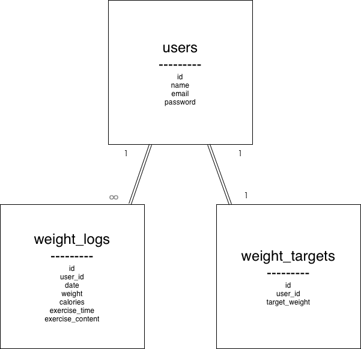

# 体重管理アプリ

## 概要

ユーザーが日々の体重を記録し、目標体重までの差分を確認できるアプリです。
ログイン機能を備えており、ユーザーごとにデータを管理できます。

---

## 機能一覧

- ユーザー登録
- ログイン / ログアウト
- 体重の新規登録
- 体重の編集
- 体重の削除
- 体重一覧表示
- 日付による検索機能
- 目標体重の設定
- 最新体重と目標との差分表示

---

## 使用技術

- Laravel
- PHP
- MySQL
- Docker

---

## テーブル設計

### usersテーブル

| カラム名 | 型     | 説明           |
| -------- | ------ | -------------- |
| id       | bigint | 主キー         |
| name     | string | ユーザー名     |
| email    | string | メールアドレス |
| password | string | パスワード     |

---

### weight_logsテーブル

| カラム名         | 型      | 説明         |
| ---------------- | ------- | ------------ |
| id               | bigint  | 主キー       |
| user_id          | bigint  | ユーザーID   |
| date             | date    | 日付         |
| weight           | float   | 体重         |
| calories         | integer | 摂取カロリー |
| exercise_time    | time    | 運動時間     |
| exercise_content | text    | 運動内容     |

---

### weight_targetsテーブル

| カラム名      | 型     | 説明       |
| ------------- | ------ | ---------- |
| id            | bigint | 主キー     |
| user_id       | bigint | ユーザーID |
| target_weight | float  | 目標体重   |

---

## ER図

usersとweight_logsは1対多の関係、usersとweight_targetsは1対1の関係です。

